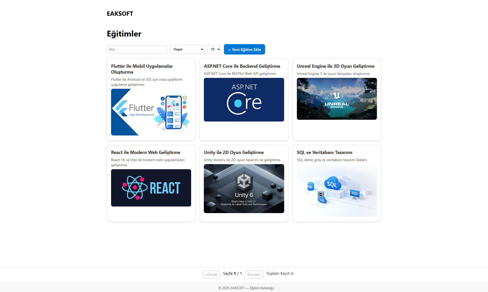

# Training Catalog Platformu

Basit eğitim kataloglarını yönetmek için hazırlanmış tam yığın (.NET 9 + React) bir referans uygulaması. Amaç; eğitim kayıtlarını oluşturup güncellemek, kategorilere göre filtreleyerek listelemek ve yayın durumuna göre görünürlük sağlamak için gereken uçtan uca akışı göstermek.

## Teslim ve Bağlam
- **Ödev teslim tarihi:** 15 Eylül 2025 Pazartesi, 23:59.
- **Teslim şekli:** Backend ve frontend GitHub depoları, README ve (varsa) Postman koleksiyonu linkleri e-posta ile `ahmetkaya@yobodobo.com` adresine iletilecek.
- **Kod sahibinin sorumlulukları:** CRUD akışının net şekilde görüleceği, özgün olarak geliştirilmiş ve teslim tarihine kadar commit'lenmiş çözümler.

## Mimari Genel Bakış
| Katman | Teknoloji | Açıklama |
| --- | --- | --- |
| Backend | .NET 9 Web API + EF Core 9 + SQLite | REST ilkelerine uygun eğitim ve kategori servisleri. Program açılışında otomatik migration uygulanır ve CORS ile React istemcisine izin verilir.【F:training-catalog-api.csproj†L1-L19】【F:Program.cs†L14-L67】 |
| Frontend | React 18 + Vite | Eğitim listesi, detay ve form ekranlarını yöneten SPA. (Bu README, frontend deposu oluşturulduğunda aynı teslim klasörüne referans vermek üzere hazırlanmıştır.) |
| Ortak | Swagger/OpenAPI | API uç noktaları için otomatik dökümantasyon.【F:Program.cs†L45-L49】【F:Program.cs†L57-L63】 |

> Frontend deposu ayrı tutulacak (`training-catalog-web` gibi). Bu README hem mevcut backend yapısını hem de React katmanı için beklentileri bir araya getirir.

## Dizin Yapısı (Backend)
```
training-catalog-api/
├── Controller/           # REST denetleyicileri (Training, Category)
├── DTO/                  # İstek/yanıt modelleri
├── Models/               # EF Core varlıkları
├── Repositories/         # Veri erişim katmanı (SQLite)
├── Services/             # İş kuralları ve mapping
├── Validators/           # FluentValidation kuralları
├── Data/AppDbContext.cs  # DbContext ve model konfigurasyonu
├── Program.cs            # Startup, DI, Swagger, CORS ve migration
└── docs/screenshots/     # README'de kullanılan SVG ön izlemeler
```

## Gereksinimler
- [.NET SDK 9.0.x](https://dotnet.microsoft.com/)
- [Node.js 20 LTS](https://nodejs.org/) ve `npm`/`pnpm`
- SQLite 3 (veya EF Core tarafından desteklenen başka bir sağlayıcı)
- İsteğe bağlı: [dotnet-ef](https://learn.microsoft.com/ef/core/cli/dotnet) aracı, Postman/Insomnia

## Ortam Değişkenleri
### Backend (`.env` veya kullanıcı gizli bilgileri)
```bash
ASPNETCORE_ENVIRONMENT=Development
ConnectionStrings__DefaultConnection=Data Source=training.db
AllowedOrigins__0=http://localhost:5173
```
> Varsayılan bağlantı dizesi `appsettings.json` dosyasında SQLite olarak ayarlanmıştır.【F:appsettings.json†L1-L11】

### Frontend (`.env`)
```bash
VITE_API_BASE_URL=https://localhost:7236/api
VITE_DEFAULT_PAGE_SIZE=9
```
React uygulaması API taban adresini bu çevresel değişken üzerinden alır ve fetch/axios katmanına aktarır.

## Kurulum ve Çalıştırma Adımları
### 1. Depoları klonlayın
```bash
git clone <backend_repo_url> training-catalog-api
git clone <frontend_repo_url> training-catalog-web
```

### 2. Backend (API)
1. Bağımlılıkları yükleyin:
   ```bash
   cd training-catalog-api
   dotnet restore
   ```
2. Veritabanını güncelleyin (gerekirse EF Core CLI):
   ```bash
   dotnet ef database update
   ```
   Uygulama açılışında migration otomatik de tetiklenir; `Program.cs` içerisinde `Database.MigrateAsync()` çağrısı bulunur.【F:Program.cs†L65-L70】
3. Geliştirme sunucusunu başlatın:
   ```bash
   dotnet watch run
   ```
   Varsayılan URL'ler: `http://localhost:5212` ve `https://localhost:7236`. Swagger arayüzü HTTPS portu üzerinden erişilebilir.【F:Properties/launchSettings.json†L1-L20】

### 3. Frontend (React + Vite)
1. Ortam değişkeni dosyasını oluşturun (`training-catalog-web/.env`):
   ```bash
   cp .env.example .env
   ```
   Ardından `VITE_API_BASE_URL` değerini backend URL'si ile güncelleyin.
2. Bağımlılıkları yükleyin ve çalıştırın:
   ```bash
   cd training-catalog-web
   npm install
   npm run dev
   ```
3. Tarayıcıdan `http://localhost:5173` adresini açın. Backend `Program.cs` dosyasında bu origin CORS politikası ile yetkilendirilmiştir.【F:Program.cs†L31-L42】

## Veri Modeli
### Training
| Alan | Tip | Not |
| --- | --- | --- |
| `Id` | int | Otomatik artan birincil anahtar |
| `Title` | string (≤120) | Zorunlu, FluentValidation ile kontrol edilir.【F:Models/Training.cs†L6-L18】【F:Validators/Training/TrainingCreateDtoValidator.cs†L1-L31】 |
| `ShortDescription` | string (≤280) | Zorunlu, maksimum uzunluk kontrolü vardır.【F:Validators/Training/TrainingCreateDtoValidator.cs†L13-L19】 |
| `LongDescription` | string | Zorunlu içerik alanı.【F:Models/Training.cs†L6-L18】 |
| `CategoryId` | int? | Opsiyonel kategori ilişkisi.【F:Models/Training.cs†L10-L13】 |
| `ImageUrl` | string? | URL doğrulaması yapılır.【F:Validators/Training/TrainingCreateDtoValidator.cs†L21-L27】 |
| `StartDate` / `EndDate` | DateTime? | Bitiş tarihi başlangıç tarihinden küçük olamaz kuralı uygulanır.【F:Validators/Training/TrainingCreateDtoValidator.cs†L19-L24】 |
| `IsPublished` | bool | Genel listede yayın filtreleri için modellenmiştir. |
| `CreatedAt` / `UpdatedAt` | DateTime? | İzlenebilirlik için tutulur. |

### Category
| Alan | Tip | Not |
| --- | --- | --- |
| `Id` | int | Birincil anahtar |
| `CategoryName` | string | Zorunlu alan; validasyon kuralları mevcut.【F:Models/Category.cs†L1-L8】【F:Validators/Category/CategoryCreateDtoValidator.cs†L1-L11】 |
| `Trainings` | ICollection&lt;Training&gt; | İlişkili eğitimler |

## API Yüzeyi
### Uç Noktalar
| Metot | URL | Açıklama |
| --- | --- | --- |
| GET | `/api/trainings?pageNumber={n}&pageSize={m}` | Eğitimleri sayfalı olarak listeler; içerik yoksa `204 No Content` döner.【F:Controller/TrainingController.cs†L17-L25】【F:Repositories/Training/TrainingRepository.cs†L33-L41】 |
| GET | `/api/trainings/{id}` | Tekil eğitim detayını döndürür; bulunamazsa `404`.|【F:Controller/TrainingController.cs†L27-L35】 |
| POST | `/api/trainings` | Yeni eğitim kaydı oluşturur; validasyon hatalarında `400`, başarıda `201 Created`.【F:Controller/TrainingController.cs†L37-L53】 |
| PUT | `/api/trainings/{id}` | Eğitim güncellemesi, yoksa `404`.|【F:Controller/TrainingController.cs†L55-L63】 |
| DELETE | `/api/trainings/{id}` | Eğitim siler; yoksa `404`.|【F:Controller/TrainingController.cs†L65-L71】 |
| GET | `/api/category` | Kategori listesi (servis üzerinden).【F:Controller/CategoryController.cs†L17-L25】 |

> CategoryController uç noktaları Training ile benzer CRUD akışını kullanır.

### Örnek İstek / Yanıtlar
#### 1. Eğitim Listeleme
```http
GET /api/trainings?pageNumber=1&pageSize=3 HTTP/1.1
Host: localhost:5212
Accept: application/json
```
```json
[
  {
    "id": 1,
    "title": "React Temelleri",
    "shortDescription": "Component yapısı, router ve form doğrulama.",
    "longDescription": "Markdown ile zengin içerik desteği...",
    "categoryId": 2,
    "imageUrl": "https://example.com/react.png",
    "startDate": "2025-10-12T00:00:00",
    "endDate": "2025-10-14T00:00:00",
    "isPublished": true
  }
]
```

#### 2. Eğitim Detayı
```http
GET /api/trainings/1 HTTP/1.1
Host: localhost:5212
Accept: application/json
```
```json
{
  "id": 1,
  "title": "React Temelleri",
  "shortDescription": "Component yapısı, router ve form doğrulama.",
  "longDescription": "Markdown ile zengin içerik desteği...",
  "category": {
    "id": 2,
    "categoryName": "Frontend"
  },
  "isPublished": true,
  "startDate": "2025-10-12T00:00:00",
  "endDate": "2025-10-14T00:00:00"
}
```

#### 3. Eğitim Oluşturma
```http
POST /api/trainings HTTP/1.1
Host: localhost:5212
Content-Type: application/json
```
```json
{
  "title": "Azure Fundamentals",
  "shortDescription": "Bulut bilişime giriş",
  "longDescription": "Azure servislerine hızlı başlangıç...",
  "categoryId": 3,
  "imageUrl": "https://example.com/azure.png",
  "startDate": "2025-11-01T09:00:00",
  "endDate": "2025-11-02T17:00:00",
  "isPublished": false
}
```
Yanıt:
```http
HTTP/1.1 201 Created
Location: /api/trainings/5
```
```json
{
  "id": 5,
  "title": "Azure Fundamentals",
  "isPublished": false
}
```

### Hata Dönüşleri
- `400 Bad Request`: FluentValidation hataları ModelState ile döner.【F:Controller/TrainingController.cs†L37-L52】
- `404 Not Found`: İstenen kayıt bulunamazsa.【F:Controller/TrainingController.cs†L27-L71】
- `204 No Content`: Liste boş olduğunda.【F:Controller/TrainingController.cs†L19-L25】

## Frontend Özeti
Planlanan React istemcisi üç ana görünüm barındırır:
1. **Liste sayfası:** Arama, kategori filtresi, sayfalama kontrolleri, yayınlanmış filtreleri.
2. **Detay sayfası:** Görsel, uzun açıklama (Markdown render), tarih ve favori butonu.
3. **Form sayfası:** Eğitim ekleme/düzenleme; client-side doğrulama ve API hata mesajlarını gösterir.

Durum yönetimi temel olarak React state veya hafif bir query kütüphanesi (React Query/SWR) ile sağlanabilir. Arama alanı için debounced istekler önerilir.

## Ekran Görüntüleri
Bu README ile birlikte teslim edilen taslak SVG ön izlemeleri:
- 
- 

Canlı ekran görüntüleri oluşturulduğunda aynı dosyaların üzerine yazabilirsiniz.

## Testler
Şu anda backend için birim testleri tanımlı değildir; en az iki servis testi eklemek bonus olarak değerlendirilecektir. Test projesi açıldığında aşağıdaki komutlarla çalıştırılabilir:
```bash
dotnet test
npm test
```

## Geliştirme Yol Haritası
- [ ] `GET /api/trainings` uç noktasına `search`, `category`, `isPublished` filtrelerini ekle.
- [ ] Favori işareti için localStorage yönetimi.
- [ ] Tarih alanları için frontend takvim bileşeni.
- [ ] Kategori dağılımı ve toplam eğitim sayısını gösteren basit bir dashboard.
- [ ] Postman koleksiyonunu versiyonlayıp `docs/` dizinine ekle.

## Katkı Kuralları
1. `main` dalından çalışın, feature dalı açmanız gerekiyorsa PR ile birleştirin.
2. Kod stilini koruyun; `FluentValidation` kurallarını DTO katmanında tanımlamaya devam edin.【F:Validators/Training/TrainingCreateDtoValidator.cs†L1-L31】
3. Her değişiklik sonrası `dotnet build` ve (varsa) frontend lint/test komutlarını çalıştırın.
4. Swagger şemasını güncel tutun; yeni uç noktalar için summary/comment ekleyin.

## Lisans
Bu proje eğitim amaçlı hazırlanmıştır. Kurum içi ödev kapsamında kullanılabilir, aksi halde yeniden dağıtım için proje sahibinin onayı gerekir.
